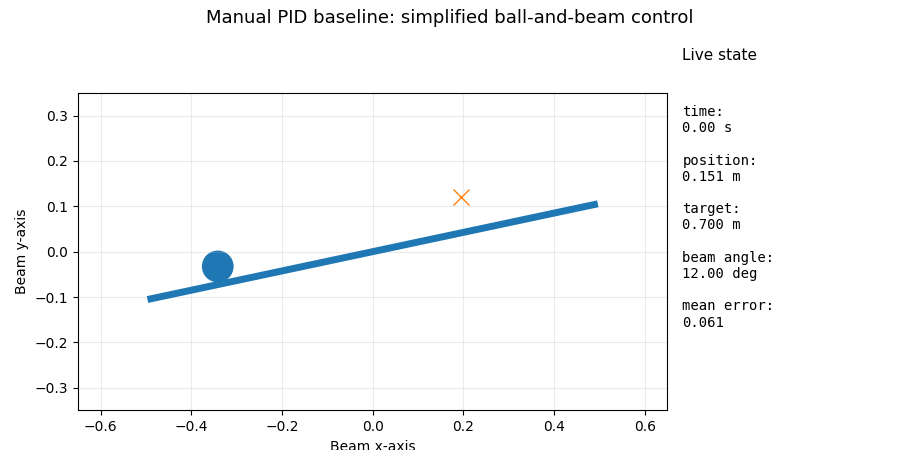
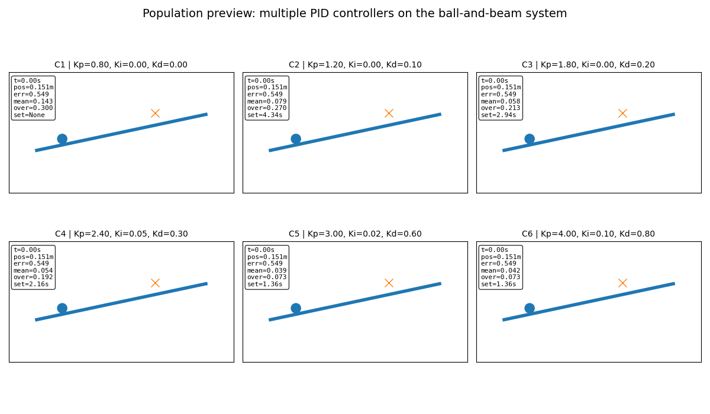
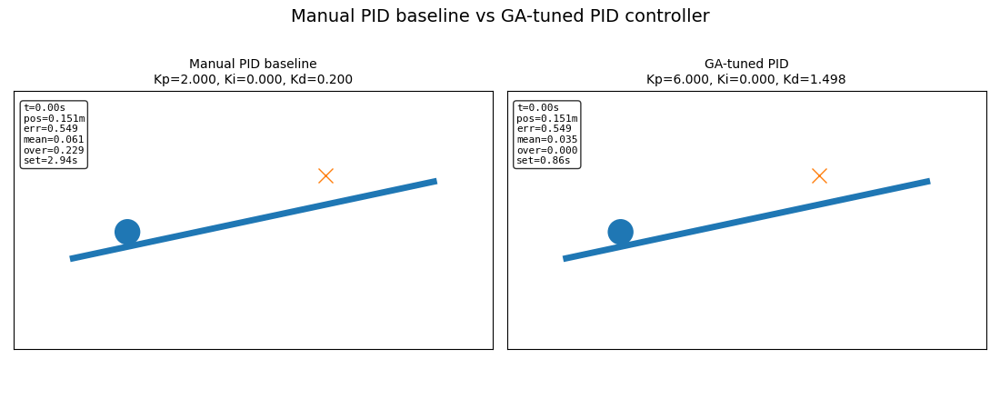
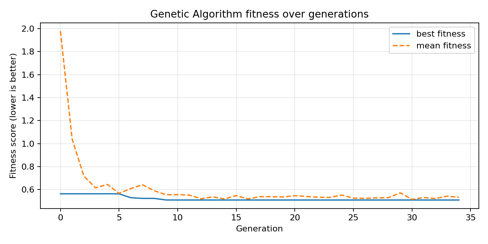
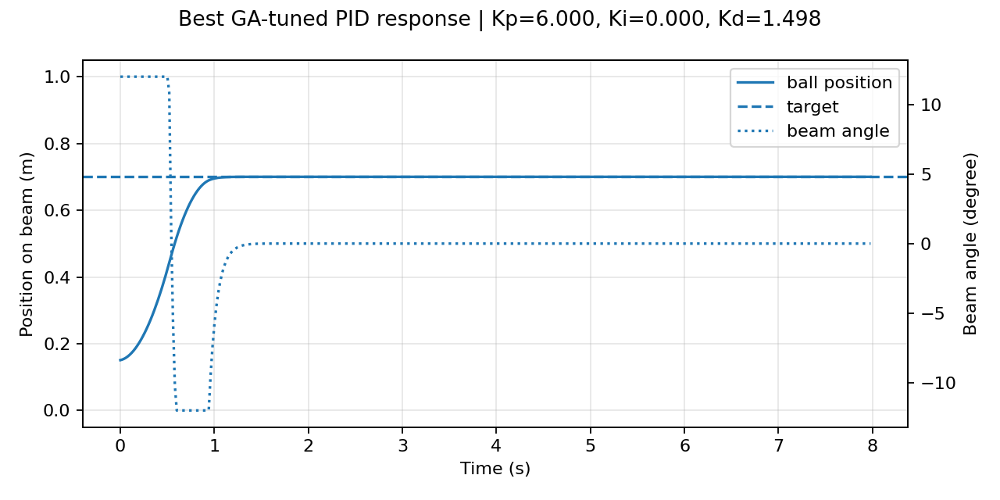

# Evolutionary Control Tuning

A visual simulation project that uses a Genetic Algorithm to tune PID controller gains for a simplified ball-and-beam control system.

The project connects three areas:

- control systems
- evolutionary optimization
- intelligent physical systems

## Project idea

Each candidate controller is represented by three PID gains:

- Kp
- Ki
- Kd

The controller is tested on a simplified ball-and-beam simulation. Poor controllers may overshoot, oscillate, or fail to stabilize the ball. Better controllers should move the ball toward the target quickly and keep it stable.

## Visual demo

### Baseline ball-and-beam simulation

### Population preview

The animation below shows multiple PID controllers acting on the same ball-and-beam system. This gives an early visual intuition for how different controller parameters produce different behaviors before applying the Genetic Algorithm.

### Manual PID vs GA-tuned PID

The final comparison tests the manually selected baseline controller against the evolved controller found by the Genetic Algorithm.

## Results summary

| Controller | Kp | Ki | Kd | Mean error | Overshoot | Settling time |
|---|---:|---:|---:|---:|---:|---:|
| Manual baseline | 2.000 | 0.000 | 0.200 | 0.0606 | 0.2291 | 2.94s |
| GA-tuned PID | 6.000 | 0.000 | 1.498 | 0.0351 | 0.0000 | 0.86s |

The GA-tuned controller reduced the mean tracking error and reached the target with less overshoot than the manual baseline.

This result should be interpreted within the selected simulation model and search range. The evolved Kp value reaches the upper bound of the current search range, so the result is useful, but not proof that the globally best PID gains have been found.

## Genetic Algorithm

The Genetic Algorithm searches for better PID gains through:

1. random population initialization
2. fitness evaluation
3. tournament selection
4. crossover
5. mutation
6. elitism

The fitness function penalizes:

- mean tracking error
- final error
- overshoot
- long settling time
- excessive control effort

Lower fitness is better.

## Fitness curve

## Best evolved response

## Repository structure

~~~text
src/
  ball_beam_sim.py
  pid_controller.py
  fitness.py
  genetic_algorithm.py

scripts/
  run_baseline.py
  animate_population.py
  run_evolution.py
  compare_controllers.py

results/
  generated plots, GIFs, and metrics
~~~

## How to run

Create a virtual environment and install the requirements:

~~~bash
python3 -m venv .venv
source .venv/bin/activate
pip install -r requirements.txt
~~~

Run the baseline simulation:

~~~bash
python scripts/run_baseline.py
~~~

Run the Genetic Algorithm:

~~~bash
python scripts/run_evolution.py
~~~

Compare the manual and evolved controllers:

~~~bash
python scripts/compare_controllers.py
~~~

## What This Version Shows

This project shows a controlled simulation experiment, not a hardware controller.

The useful result is the comparison between a manually selected PID baseline and a GA-tuned PID controller on the same simplified ball-and-beam model.

The current evolved controller improves the simulated response, but the result depends on:

- the simplified dynamics model
- the selected PID gain bounds
- the fitness function weights
- the simulation time horizon
- the absence of real sensor noise, servo delay, backlash, and mechanical friction

## Limitations

Current limitations:

- the plant is a simplified simulation, not the real ball-and-beam hardware
- the Genetic Algorithm searches only inside predefined gain ranges
- the evolved Kp reaches the upper edge of the current search range
- the fitness function reflects chosen design priorities, not a universal control objective
- the controller has not yet been tested with real sensor feedback
- the simulation does not model all real mechanical effects from the hardware prototype

---

## Current status

This project is a visual simulation prototype for comparing manual PID tuning with GA-based PID tuning.

A useful future improvement would be refining the gain search range and fitness function, then testing whether the evolved controller still behaves well under noise, delay, and more realistic plant assumptions.
